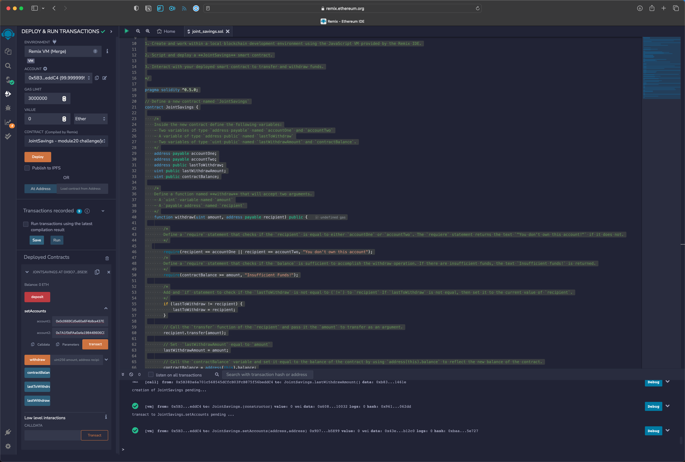
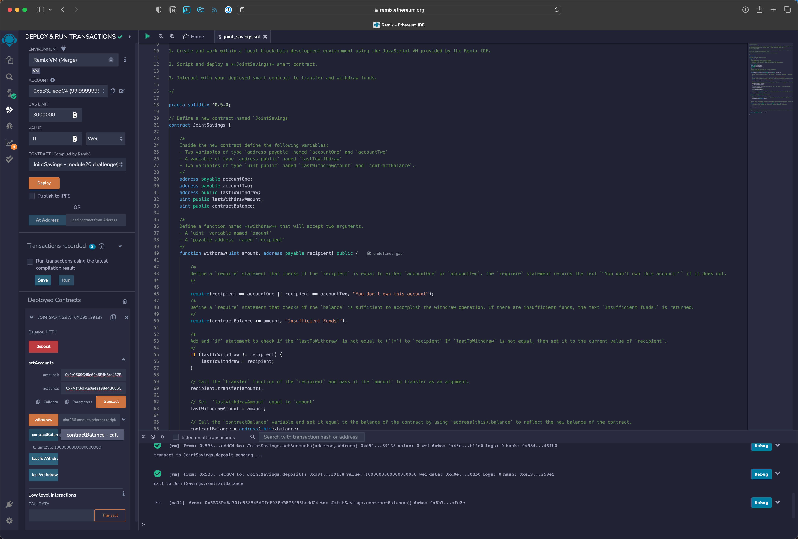
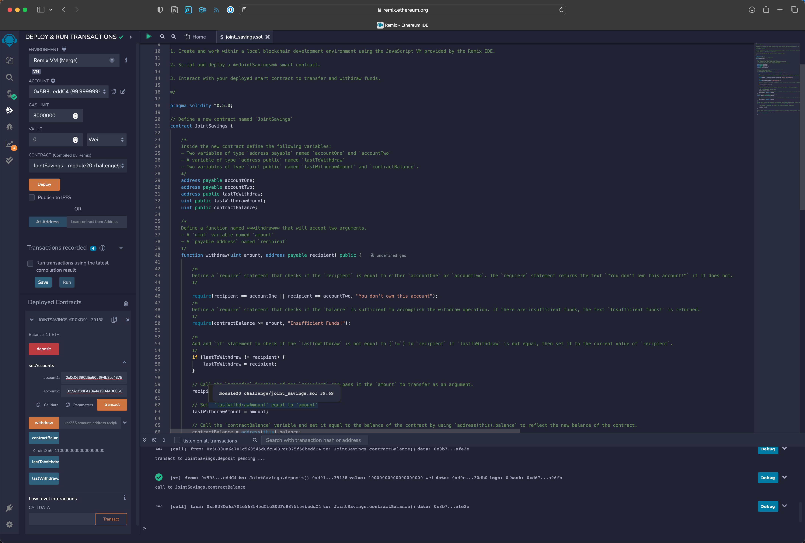
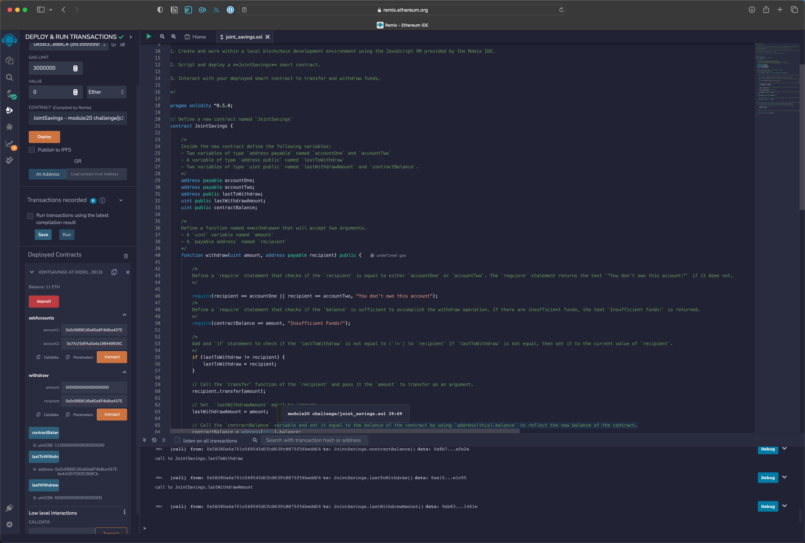
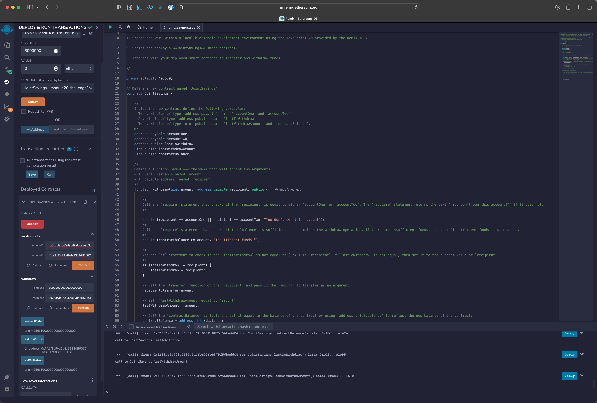

# Module 20 Challenge

## Introduction
The focus of this challenge was to implement code that creates a joint savings account using a Solidity smart contract.

## Technology
Code was developed using Solidity version 0.5.0 in the [Remix IDE](https://remix.ethereum.org). 

## Images

  
  
  
  
  
  

